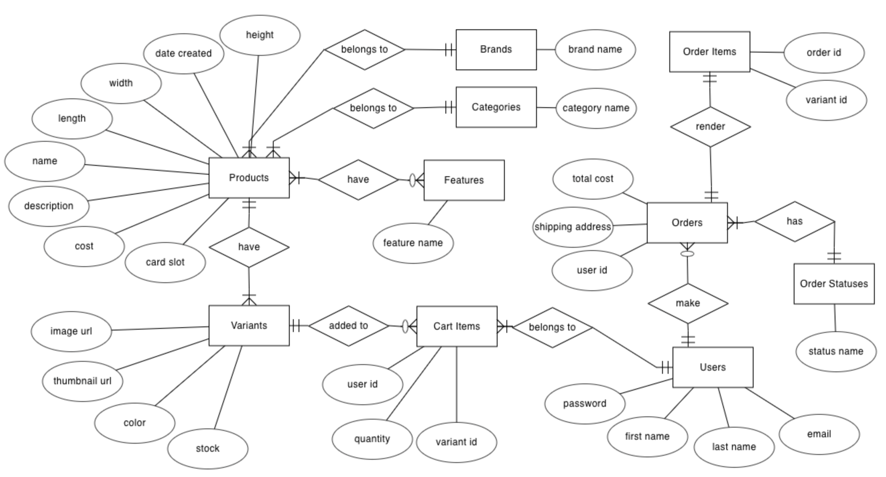
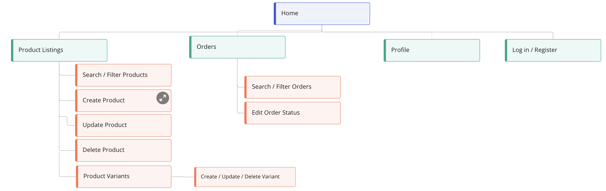

# Warlet


Live demo for customers can be accessed [here](https://warlet.netlify.app/).
* Test Account: 
    * Email: customer@gmail.com
    * Password: @abcd1234

Live demo for admin/shop owners can be accessed [here](https://warlet.herokuapp.com/).
* Test Account: 
    * Email: test@gmail.com
    * Password: abcd1234@

## Project Overview 

**Context and Value Proposition**

Most websites either sell only a certain wallet brand which limits the customer's choice or they sell all kinds of wallet, including other related items such as bags.

My website sells different brands of wallet for young men that is stylish yet affordable.

## UI/UX 

**1. Strategy**

**Organisation's Goals** 

To establish an e-commerce store that sells a wide range of men wallet with different brands, categories, colours and unique features to choose from.

**User** 

- Demographic: Young men between the ages of 18-39 is our target audience. They usually want something stylish but not too expensive.

- Needs: Search for wallet according to a certain brand, category, color, number of card slots, and unique features.

- Pain points: most ecommerce stores sell only one brand of wallet or they lump wallets together with other items making it hard for users if they are only interested in wallets.

| User Stories | Acceptance Criteria(s) |
| ------------ | ---------------------- |
| I would like to know the name, brand and category of the wallet. | Website allows users to search wallets by name, brand and category. |
| I have a certain budget allocated for the wallet | Website allows users to filter wallets by a minimum and maximum price. |
| I would like to know if the wallet has enough card slots for me. | Website allows users to filter wallets by number of card slots |
| I would like to know if the wallet has a coin pocket or if it's RFID blocking. | Website allows users to filter wallets by unique features. |

**2. Scope** 

**Database**

ERD Diagram

<figure>
    
</figure>

Logical Schema


**Functional**

* For customers: 
    * Account registration, view profile, login and logout
    * Browse product listing, filter/search products and view details of individual product
    * Add products to cart
    * Cart management (update quantity of products, remove products from cart and checkout/make payment via Stripe)
    * View past orders after purchase

* For admins/shop owners: 
    * Register, login and logout for admin/shop owner
    * Product and product's variants management (create, read, update, delete)
    * Filter/search for products
    * Orders management (view order details, update order status)
    * Filter/search for orders

**Non-Functional** 

- Application is mobile responsive

**3. Structure** 

**Frontend/Users**

 

Checkout, order details, user profile and logout are only accessible after user has logged in successfully. 

**Backend/Owner**
<figure>
    
</figure>

**4. Surface**

**Fonts** 

- Lato
- Roboto

## Technologies Used 

**Frontend**

Technology                                                                                  | Description
------------------------------------------------------------------------------------------  | -----------
[Stripe](https://stripe.com/)                                                               | Payment gateway
[axios](https://github.com/axios/axios)                                                     | Axios as HTTP client to Express server endpoints
[Bootstrap 5](https://github.com/twbs/bootstrap)                                            | Bootstrap is used to create a mobile responsive web application
[ReactJS](https://reactjs.org/)                                                             | ReactJS is a frontend JavaScript framework used for building user interfaces specifically for single-page application
[react-hook-form](https://github.com/react-hook-form/react-hook-form)                       | React-Hook-Form is used to handle and validate forms in the application. 
[react-router-dom](https://github.com/remix-run/react-router)                               | Declarative routing for ReactJS
[react-toastify](https://fkhadra.github.io/react-toastify/introduction)                     | Toast notification for ReactJS

**Backend**

| Technology | Description |
| ------------ | ---------------------- |
| [Express](https://expressjs.com/) | Unopionated framework for routing to project's endpoints |
| [Handlebars](https://github.com/pillarjs/hbs) | Express.js view engine |
| [cors](https://www.npmjs.com/package/cors) | Middleware to enable CORS for Express.js |
| [csurf](https://www.npmjs.com/package/csurf) | Middleware to enable CSRF for Express.js |
| [dotenv](https://github.com/motdotla/dotenv) | Storing configuration in the environment separate from code |
| [express-session](https://www.npmjs.com/package/express-session) | Middleware to create sessions on Express.js |
| [express-flash](https://www.npmjs.com/package/express-flash) | Flash messages middleware |
| [JsonWebToken](https://github.com/auth0/node-jsonwebtoken) | Securely transmitting information between parties as a JSON object |
| [MySQL](https://www.mysql.com/) | Database |
| [db-migrate](https://db-migrate.readthedocs.io/en/latest/) | Database migration framework for Node.js |
| [Knex.js](https://knexjs.org/) | Query builder for PostgreSQL, MySQL, CockroachDB, SQL Server, SQLite3 and Oracle on Node.js |
| [Bookshelf](https://bookshelfjs.org/) | JavaScript ORM for Node.js, built on the Knex SQL query builder |
| [Caolan forms](https://github.com/caolan/forms) | Create, parse and validate forms in Node.js |
| [Cloudinary](https://cloudinary.com/) | Image hosting service used to upload and store the project's images |
| [Stripe](https://stripe.com/en-sg) | Payment gateway |


## Testing 

Test Cases can be found [here](/src/img/warlet_test_case.pdf).

## Deployment 

**Frontend Deployment**

The web application is hosted using [Netlify](https://www.netlify.com/), deployed directly from the main branch of this GitHub repository. For the detailed deployment steps, you may refer [here](https://www.netlify.com/blog/2016/09/29/a-step-by-step-guide-deploying-on-netlify/).

**Backend Deployment**

Deployment is done through Heroku. For the detailed deployment steps, you may refer [here](https://devcenter.heroku.com/articles/git#deploy-your-code).


The following environment variables: 
```
CLOUDINARY_NAME=
CLOUDINARY_API_KEY=
CLOUDINARY_API_SECRET=
CLOUDINARY_UPLOAD_PRESET=
DB_DRIVER=
DB_USER=
DB_PASSWORD=
DB_DATABASE=
DB_HOST=
STRIPE_PUBLISHABLE_KEY=
STRIPE_SECRET_KEY=
STRIPE_SUCCESS_URL=
STRIPE_CANCEL_URL=
STRIPE_ENDPOINT_SECRET=
TOKEN_SECRET=
REFRESH_TOKEN_SECRET=
```

## Challenges and Future Implementations 

1. Allow users to add items to cart without logging in and only require logging in when checking out.
2. Allow users to update quantity of cart items by clicking on increase/decrease buttons similar to the ones when adding to cart. 
4. Allow users to reset their password under profile page.
5. Allow admin to view user accounts, update user information and delete a user. 
6. Improve layout and design of admin page.


## Credits 

**Fonts, Icons and Images** 

- [Google Font](https://fonts.google.com/about) for web pages fonts
- [React Bootstrap Icons](https://www.npmjs.com/package/react-bootstrap-icons) for icons
- [Bootstrap 5](https://getbootstrap.com/) for components and utilities
- [Unsplash](https://unsplash.com/) for landing page backgroud image
- [Canva](https://www.canva.com/) for the brand logo

**Others** 
- [https://ui.dev/amiresponsive](https://ui.dev/amiresponsive) - Display mobile responsiveness
- [Miro](https://miro.com/) - Design structure of page
- [ERDPlus](https://erdplus.com/) - Construct ERD diagram
- [SqlDBM](https://sqldbm.com/Home/) - Construct logical schema 
- Product information, product images and web layouts: 
    - [The Wallet Shop](https://thewalletshop.com/)
    - [Bellroy](https://bellroy.com/products/category/wallets)
- TGC community for guidance on various problems encountered